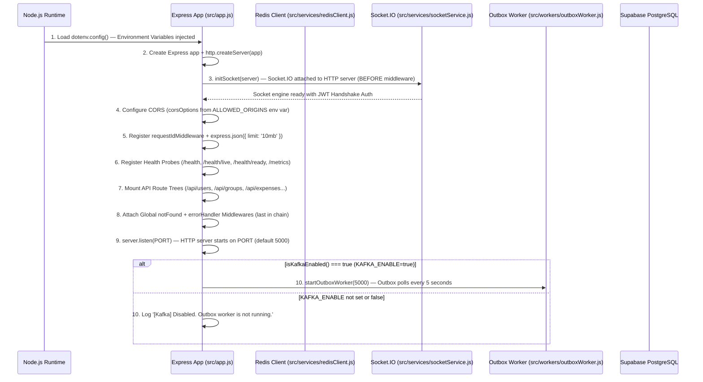
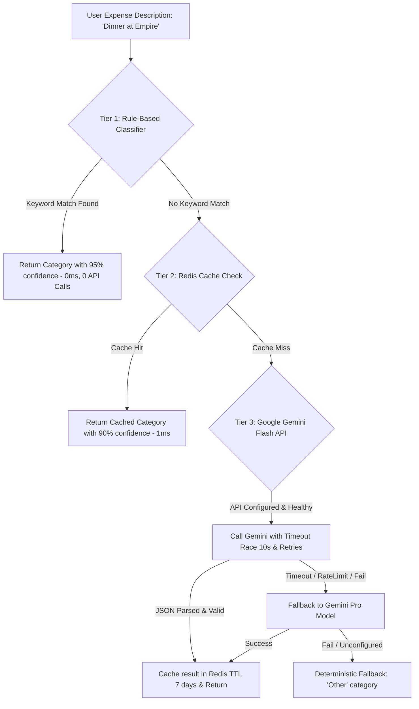

# TripSync (Splitwiser) — Complete Codebase Architecture & Technical Interview Preparation Guide

---

## 1. PROJECT EXECUTIVE SUMMARY

### What the Project Is
**TripSync** (internally identified as **Splitwise / Track-trips**) is a production-grade, full-stack collaborative travel and group expense management platform. It allows travel groups to track shared expenses across complex multi-currency/multi-split scenarios, manage trip itineraries and geocoded places visited, compute optimal debt-minimization settlement graphs in integer precision (paise), and interact with an integrated AI Copilot (powered by Google Gemini) for automated expense categorization, natural-language financial queries, and settlement explanations.

### What Problem It Solves
Traditional group expense tools often suffer from:
1. **Floating-point rounding errors** (e.g., fractional cent/paise drift across uneven split divisions).
2. **Suboptimal debt cycles** where multiple members make redundant circular payments to settle a shared trip.
3. **Friction in expense categorization and auditing** during fast-paced travel.
4. **Lack of real-time multi-device sync** when multiple travelers log expenses simultaneously offline or on spotty network connections.

TripSync solves this with a **zero-drift integer-arithmetic split engine**, an **$O(N \log N)$ greedy two-pointer debt minimization algorithm**, **WebSocket-driven real-time state synchronization**, a **tiered AI classification & copilot engine with deterministic fallback guarantees**, and an **event-driven transactional outbox pattern** for enterprise-scale integration.

### Who Uses It
- Travel groups, backpackers, flatmates, and event organizers who need transparent, real-time shared budget tracking, itinerary planning, and painless end-of-trip debt settlements.

### Main Features Implemented in Code
1. **Multi-Strategy Split Engine**: Supports 6 distinct allocation algorithms: `EQUAL`, `EXACT`, `PERCENTAGE`, `SHARES`, `ADJUSTMENT`, and `ITEMIZED`.
2. **Optimal Debt Minimization**: Automatically simplifies multi-party debt networks into the minimum number of direct transactions while enforcing mathematical zero-sum invariants.
3. **Payment State Machine**: Handles pending, soft-settled, and hard-settled payments with automatic recalculation and debt-locking safeguards.
4. **Real-time Live Sync**: Socket.IO room-based event broadcasting for expenses, settlements, places visited, and trip creation.
5. **Tiered AI Engine**:
   - **Tier 1**: 0ms in-memory keyword rule classifier.
   - **Tier 2**: 1ms Redis cache.
   - **Tier 3**: Google Gemini Flash/Pro LLM with exponential backoff, timeout races, and strict anti-hallucination currency validators.
6. **Robust Auth & Security**: JWT-based session verification (7-day TTL), BCrypt password hashing, OTP-based password reset with HMAC constant-time validation and Redis brute-force throttling, plus distributed Lua-based Redis rate limiting.
7. **Itinerary & Place Tracking**: Geo-tagged points of interest (`places_visited`) with photo upload support via Multer.
8. **Observability & Diagnostics**: Centralized structured JSON logging, in-memory metric registry with average latency calculation, and container health probes (`/health/live`, `/health/ready`, `/metrics`).

### High-Level Architecture
```
[React 18 SPA + PWA Client (Vercel)]
       │
       │ HTTPS / WSS (CORS + JWT Auth Header)
       ▼
[Express 5 Node.js API Gateway & WebSocket Server (AWS ECS Fargate / Render)]
   ├── Middlewares: RequestID -> RateLimiter (Redis Lua) -> Zod Validator -> JWT Auth
   ├── Core Services: SplitEngine (Paise Math) | SettlementAlgo (Greedy Minimizer)
   ├── Tiered AI Service: Rule Engine -> Redis Cache -> Gemini Flash API (with Retries/Timeouts)
   ├── Socket.IO Engine: Room-based trip/group broadcasting
   └── Transactional Outbox Worker: Poller with Exponential Backoff -> Apache Kafka Event Bus
       │
       ├── State & Persistence: Supabase (PostgreSQL 15 with PL/pgSQL Triggers & RPCs)
       ├── In-Memory Store: Redis 7 (TTL Caches, Distributed Rate Limiting, OTP verification)
       └── External Services: Resend / Nodemailer (Transactional Emails), Google Generative AI
```

### 30-Second Interview Explanation
> "I built **TripSync**, a full-stack group travel expense and debt settlement platform built with React, Node.js/Express, PostgreSQL via Supabase, and Redis. It solves the headache of group financial reconciliation by implementing a custom integer-based split engine with six allocation strategies, an $O(N \log N)$ greedy debt minimization algorithm that simplifies complex balance graphs, and real-time Socket.IO synchronization. I also integrated an AI financial copilot using Google Gemini with a 3-tiered fallback architecture to ensure deterministic zero-drift calculations even if LLM calls fail or hallucinate."

### 2-Minute Interview Explanation
> "TripSync is an end-to-end travel expense and settlement ecosystem designed to handle complex group finances with absolute mathematical integrity. 
> 
> On the backend, we run an Express.js engine that eliminates IEEE-754 floating-point inaccuracies by computing all splits—including percentage, itemized, and share-based allocations—strictly in integer sub-units (paise), distributing remainders based on fractional rank. To settle debts, I implemented a greedy two-pointer settlement algorithm that condenses hundreds of cross-member debts into the minimal number of direct transfers while continuously asserting zero-sum invariants.
> 
> For the data layer, we leverage PostgreSQL via Supabase with row-level constraints and atomic PL/pgSQL procedures. To maintain high throughput, we use Redis for distributed sliding-window rate limiting via atomic Lua scripts, 5-minute cache TTLs on analytics and settlement snapshots, and OTP brute-force protection.
> 
> The application also features real-time Socket.IO room broadcasting and an asynchronous transactional outbox worker pushing to Apache Kafka for event-driven decoupled services. For the AI features, I designed a multi-tiered pipeline: instant keyword regex classification at Tier 1, Redis caching at Tier 2, and Google Gemini at Tier 3 with exponential backoff and strict anti-hallucination guardrails that replace corrupted LLM outputs with deterministic snapshots. The entire stack is containerized with Docker multi-stage builds and automated via GitHub Actions CI/CD to AWS ECS Fargate."

---

## 2. COMPLETE REPOSITORY MAP

```
Splitwise/
├── .github/
│   └── workflows/
│       ├── ci.yml                 # Node 24 CI validation: syntax check, npm audit, React tests & build
│       └── deploy.yml             # CD pipeline: Builds Docker image, pushes to AWS ECR, updates ECS Fargate
├── backend/
│   ├── Dockerfile                 # Multi-stage production build (node:20-alpine builder + runner)
│   ├── package.json               # Backend dependencies (Express 5, Supabase, Redis, KafkaJS, Socket.io, Gemini)
│   ├── .env.example               # Template for environment configuration
│   ├── test_settlement_consistency.mjs  # Direct test suite verifying settlement invariant math
│   ├── test_split_engine.mjs            # Unit tests for all 6 split allocation algorithms
│   └── src/
│       ├── app.js                 # Express application & HTTP/Socket server bootstrapping, CORS, health probes
│       ├── controllers/
│       │   ├── aiController.js         # Endpoints for Gemini AI category suggestion, settlement explain, copilot
│       │   ├── analyticsController.js  # Category and user spending breakdown with Redis caching
│       │   ├── expenseController.js    # Add/delete expense with outbox transactional RPC & cache invalidation
│       │   ├── groupController.js      # Group CRUD, membership verification, invite codes, group password hashing
│       │   ├── paymentsController.js   # Debt settlement state machine (pending/completed/reset)
│       │   ├── placeController.js      # Itinerary locations & photo uploads (Multer)
│       │   ├── settlementController.js # Settlement computation endpoint with Redis caching
│       │   ├── tripController.js       # Trip CRUD and trip-level member management
│       │   └── userController.js       # Registration, login, OTP generation, password reset
│       ├── db/                         # Database schema & outbox SQL definitions
│       ├── middleware/
│       │   ├── auth.js                 # JWT verification (Bearer token) and token generation
│       │   ├── errorHandler.js         # Centralized error handler with Zod validation formatting & error IDs
│       │   ├── rateLimiter.js          # Distributed Redis Lua atomic rate limiter with in-memory fallback
│       │   ├── requestId.js            # Injects unique X-Request-ID (UUID v4) into req context
│       │   └── validate.js             # Zod schema validation middleware for API request bodies
│       ├── routes/                     # Express router definitions mapping routes to controllers
│       ├── services/
│       │   ├── geminiService.js        # Google Gemini AI client, 3-tier classifier, copilot prompt & guardrails
│       │   ├── kafkaProducer.js        # KafkaJS producer client with opt-in flag & exponential retry
│       │   ├── mailer.js               # Resend / Nodemailer transactional email delivery
│       │   ├── redisClient.js          # IORedis client, cache get/set/invalidate helpers, health telemetry
│       │   ├── socketService.js        # Socket.IO initialization, JWT handshake auth, room management
│       │   └── supabaseClient.js       # Supabase client initialized with Service Role Key
│       ├── utils/
│       │   ├── hash.js                 # BCrypt password hashing & comparison utilities
│       │   ├── logger.js               # Structured JSON production logger with severity levels
│       │   ├── metrics.js              # In-memory Prometheus-style metrics registry
│       │   ├── settlementAlgo.js       # 2-Pointer greedy debt simplification algorithm & mathematical invariant checks
│       │   └── splitEngine.js          # 6-Strategy zero-loss integer paise expense allocation engine
│       └── workers/
│           ├── analyticsWorker.js      # Background worker for aggregated analytics rollup
│           ├── emailWorker.js          # Background queue for dispatching deferred emails
│           └── outboxWorker.js         # Transactional outbox polling poller for Kafka with dead-letter queue
├── deployment/
│   ├── aws-ecs-task-definition.json    # AWS ECS Fargate task definition with AWS Secrets Manager bindings
│   └── k6-load-test.js                 # k6 load testing script for benchmark validation
├── docker-compose.yml                  # Local orchestration for Backend, Redis 7 Alpine, and Apache Kafka (KRaft mode)
├── frontend/
│   ├── package.json                    # React 18, Tailwind CSS, Recharts, Framer Motion, Axios, Socket.io-client
│   ├── tailwind.config.js              # Tailwind styling tokens and custom theme colors
│   ├── public/                         # Static assets, PWA manifest.json, icons
│   └── src/
│       ├── App.js                      # React Router v6 setup, ProtectedRoute wrappers, Toast & Context providers
│       ├── index.js                    # React DOM root entry point
│       ├── components/
│       │   ├── CreateGroupModal.js     # Modal for initializing groups with optional password protection
│       │   ├── CreateTripModal.js      # Modal for creating trips under specific groups
│       │   ├── FloatingAICopilotButton.js # Global floating drawer UI for the Gemini AI Financial Copilot
│       │   ├── JoinGroupModal.js       # Modal to join via Group ID & password
│       │   ├── Layout.js               # App shell containing responsive Navbar, Theme toggle, and user menu
│       │   ├── ProtectedRoute.js       # Route guard redirecting unauthenticated users to `/login`
│       │   └── PWAInstallPrompt.js     # Native PWA install prompt handler
│       ├── context/
│       │   ├── AuthContext.js          # Global user authentication state and localStorage persistence
│       │   └── ThemeContext.js         # Dark/Light mode theme state management
│       ├── hooks/
│       │   └── useSocket.js            # Custom hook connecting to Socket.IO trip and group rooms
│       ├── pages/
│       │   ├── Dashboard.js            # Home view displaying user groups, active trips, and quick stats
│       │   ├── GroupDetail.js          # Deep view of a group: member list, trip tabs, group invite generation
│       │   ├── InviteJoin.js           # Public landing route for joining groups via signed invite tokens
│       │   ├── Landing.js              # Public marketing landing page
│       │   ├── Login.js                # Login page with validation and redirect logic
│       │   ├── Register.js             # Registration form with password strength checking
│       │   ├── ResetPassword.js        # 2-Step OTP and password reset UI
│       │   └── TripDetail.js           # Core trip view: Expense lists, Split modal, Settlements, Analytics, Places
│       └── services/
│           └── api.js                  # Centralized Axios instance with request/response interceptors & auto-logout
└── supabase/
    ├── schema.sql                      # Base PostgreSQL schema (tables, foreign keys, triggers, updated_at)
    ├── migration.sql                   # Incremental schema evolution and constraint upgrades
    ├── schema_outbox.sql               # Outbox table and atomic `insert_expense_with_outbox` PL/pgSQL function
    └── supabase_complete_v2_migration.sql # Full idempotent database synchronization script
```

---

## 3. COMPLETE TECHNOLOGY STACK

| Category | Technology | Usage in Code | Verified File References |
| :--- | :--- | :--- | :--- |
| **Languages** | JavaScript (ES Modules, ES2022) | Full-stack codebase written in clean modern ESM (`import`/`export`) | `backend/package.json` (`"type": "module"`), `frontend/src/App.js` |
| **Frontend Framework** | React 18.3.1 | Core UI single-page application | `frontend/package.json`, `frontend/src/index.js` |
| **Routing** | React Router DOM v6.20.1 | Client-side routing with `ProtectedRoute` guards | `frontend/src/App.js` |
| **Styling & Animation** | Tailwind CSS 3.3.6, Framer Motion 11.0.0 | Utility-first responsive design, dark mode, smooth UI transitions | `frontend/tailwind.config.js`, `frontend/src/components/FloatingAICopilotButton.js` |
| **Data Visualization** | Recharts 2.15.4 | Category and member spending donut & bar charts | `frontend/src/pages/TripDetail.js`, `frontend/src/pages/GroupDetail.js` |
| **Backend Framework** | Express 5.1.0 | REST API gateway, routing, and HTTP server | `backend/src/app.js`, `backend/package.json` |
| **Real-Time Engine** | Socket.IO 4.8.3 (Client & Server) | WebSocket room-based live broadcasting (`trip:*`, `group:*`, `user:*`) | `backend/src/services/socketService.js`, `frontend/src/hooks/useSocket.js` |
| **Database** | PostgreSQL 15 (Supabase Hosted) | Relational persistence, UUID keys, JSONB columns, PL/pgSQL triggers | `supabase/schema.sql`, `supabase/schema_outbox.sql` |
| **Data Access / Client** | `@supabase/supabase-js` 2.79.0 | Direct PostgreSQL client using service role key and RPC execution | `backend/src/services/supabaseClient.js`, `backend/src/controllers/expenseController.js` |
| **Caching & In-Memory** | Redis 7 / `ioredis` 5.4.1 | 5-minute snapshot caching, Lua atomic rate limiting, OTP storage | `backend/src/services/redisClient.js`, `backend/src/middleware/rateLimiter.js` |
| **Message Broker** | Apache Kafka 3.x / `kafkajs` 2.2.4 | Event streaming for trip & expense lifecycle events | `backend/src/services/kafkaProducer.js`, `backend/src/workers/outboxWorker.js` |
| **AI / LLM Integration** | Google Gemini (`@google/generative-ai` 0.24.1) | Gemini Flash Latest (primary) & Gemini Pro (fallback) for categorizer & copilot | `backend/src/services/geminiService.js`, `backend/src/controllers/aiController.js` |
| **Auth & Security** | `jsonwebtoken` 9.0.2, `bcrypt` 6.0.0 / `bcryptjs` 3.0.3 | 7-day signed JWT tokens, BCrypt salt-10 password hashing | `backend/src/middleware/auth.js`, `backend/src/utils/hash.js` |
| **Validation** | Zod 3.22.4 | Strict runtime schema validation for incoming JSON payloads | `backend/src/middleware/validate.js` |
| **File Handling** | Multer 1.4.5-lts.1 | Multipart/form-data parsing for place photo uploads | `backend/src/controllers/placeController.js` |
| **Email Delivery** | Nodemailer 9.0.5, Resend 3.0.0 | Transactional email delivery for 6-digit OTP password reset | `backend/src/services/mailer.js`, `backend/src/controllers/userController.js` |
| **Containerization** | Docker & Docker Compose | Multi-stage production container, local 3-tier compose setup | `backend/Dockerfile`, `docker-compose.yml` |
| **Cloud Hosting** | AWS ECS Fargate, Amazon ECR, Render, Vercel | Production containerized backend on AWS ECS / Render; Frontend on Vercel | `deployment/aws-ecs-task-definition.json`, `DEPLOYMENT.md` |
| **CI / CD** | GitHub Actions | Automated syntax checks, audits, React test suite, ECR build & ECS deploy | `.github/workflows/ci.yml`, `.github/workflows/deploy.yml` |
| **Testing & Benchmark** | Jest, Testing Library, k6 | React component tests, custom algorithmic test suites, k6 load test | `backend/test_split_engine.mjs`, `deployment/k6-load-test.js` |

### Resume-Ready Tech Stack Line
```text
Tech Stack: React 18, Node.js, Express 5, PostgreSQL (Supabase), Redis 7, Socket.IO, Apache Kafka, Google Gemini LLM, Docker, AWS ECS Fargate, Tailwind CSS, Zod, JWT
```

---

## 4. COMPLETE SYSTEM ARCHITECTURE

### Architectural Layers

```
                                  [ CLIENT TIER ]
                 React 18 SPA (Vercel) / Progressive Web App (PWA)
          ┌───────────────────────────────┬──────────────────────────────┐
          │ HTTP / REST (Axios)           │ WebSockets (Socket.IO Client)│
          ▼                               ▼                              │
┌────────────────────────────────────────────────────────────────────────┴───┐
│                           [ INGRESS & GATEWAY LAYER ]                      │
│                Express 5 Application Server (AWS ECS Fargate / Render)     │
│                                                                            │
│  [Middlewares Pipeline]                                                    │
│  1. CORS Origin Validation                                                 │
│  2. Request ID Injection (UUID v4 in req.id & X-Request-ID)                │
│  3. Distributed Rate Limiter (Redis Atomic Lua Token Bucket)               │
│  4. Zod Schema Validation (Request body, params, query)                    │
│  5. JWT Authentication Guard (Bearer Token verification)                   │
└─────────────────────────────────────┬──────────────────────────────────────┘
                                      │
           ┌──────────────────────────┴──────────────────────────┐
           ▼                                                     ▼
┌──────────────────────────────────────┐  ┌──────────────────────────────────┐
│        [ CORE BUSINESS LOGIC ]       │  │        [ REAL-TIME ENGINE ]      │
│  - SplitEngine (Paise Math)          │  │  - Socket.IO Server              │
│  - Settlement Minimizer (2-Pointer)  │  │  - Room Manager:                 │
│  - Payment State Machine             │  │    * `trip:<trip_id>`            │
│  - Trip/Group Access Controller      │  │    * `group:<group_id>`          │
│  - OTP Password Reset Manager        │  │    * `user:<username>`           │
└──────────────────┬───────────────────┘  └──────────────────────────────────┘
                   │
    ┌──────────────┼──────────────────────────────┬──────────────────────────┐
    ▼              ▼                              ▼                          ▼
┌──────────────┐ ┌─────────────────────────┐  ┌─────────────────────────┐  ┌──────────────────────────┐
│ [DATABASE]   │ │ [IN-MEMORY & CACHE]     │  │ [AI & LLM PIPELINE]     │  │ [EVENT STREAMING]        │
│ Supabase     │ │ Redis 7 (ioredis)       │  │ Google Gemini Flash/Pro │  │ Transactional Outbox     │
│ PostgreSQL   │ │ - 5-min Settlement Cache│  │ - 3-Tier Classifier     │  │ Worker -> Apache Kafka   │
│ - Schema     │ │ - Distributed Rate Limit│  │ - Financial Copilot     │  │ Topics: `trip-events`,   │
│ - PL/pgSQL   │ │ - OTP Brute-force Lock  │  │ - Safe Currency Guard   │  │ `expense-events`         │
│ - Outbox RPC │ │ - Invalidation Triggers │  │ - Deterministic Fallback│  │ (Dead-letter after 5x)   │
└──────────────┘ └─────────────────────────┘  └─────────────────────────┘  └──────────────────────────┘
```

### Layer Responsibilities
1. **Client / Frontend**: React 18 SPA rendering dynamic views (Dashboard, GroupDetail, TripDetail). Handles local optimistic updates, dark/light theme switching, PWA offline caching, QR-code sharing, and AI Copilot interaction.
2. **Ingress & Middleware**: Validates incoming payloads via Zod, enforces distributed rate limits using atomic Redis Lua scripts, verifies JWT signatures, and tags every transaction with a traceable `requestId`.
3. **Domain & Business Logic**: Operates purely on immutable integer calculations (`paise`). Computes split distributions, filters eligible trip participants, and minimizes debt graphs.
4. **Data Access Layer**: Supabase client operating with high-privilege service-role tokens, invoking PostgreSQL functions (`insert_expense_with_outbox`) to maintain ACID guarantees.
5. **Real-time Event Broadcasting**: Socket.IO instance attached to HTTP server. Emits granular domain events (`expense:added`, `expense:deleted`, `settlement:updated`, `trip:created`) directly to connected socket rooms.
6. **Background Outbox Poller**: Periodically inspects `outbox_events`, dispatches payloads to Apache Kafka with exponential backoff, and routes dead messages to a dead-letter state after 5 retries.

---

## 5. APPLICATION STARTUP FLOW

When the backend process begins (`node src/app.js`), the following exact sequence executes:



> ⚠️ **Important**: Note that there is **no Helmet or Morgan middleware** in `app.js`. Socket.IO is initialized (`initSocket`) **before** any CORS or JSON middleware is registered. The HTTP server is created via `http.createServer(app)`, not `app.listen()` directly, because Socket.IO must attach to the raw HTTP server instance.

### Exact Code References (verified against actual file):
- **dotenv + http.createServer**: `backend/src/app.js` (lines 1–27)
- **Socket Initialization**: `backend/src/app.js` (line 30) → `initSocket(server)` from `socketService.js`
- **CORS Configuration**: `backend/src/app.js` (lines 33–56)
- **Request ID + JSON Parser**: `backend/src/app.js` (lines 57–59)
- **Health Probes** (`/health/live`, `/health/ready`, `/health`, `/metrics`): `backend/src/app.js` (lines 62–108)
- **Route Registration**: `backend/src/app.js` (lines 111–119)
- **Error Handlers** (`notFound`, `errorHandler`): `backend/src/app.js` (lines 122–123)
- **Outbox Worker Start**: `backend/src/app.js` (lines 134–142) inside `server.listen()` callback

---

## 6. COMPLETE REQUEST LIFECYCLE

### Trace 1: Adding a Shared Expense with Split Calculation (`POST /api/expenses`)

```mermaid
sequenceDiagram
    autonumber
    participant User as React Frontend (TripDetail.js)
    participant Auth as Auth Middleware (src/middleware/auth.js)
    participant Valid as Zod Validator (src/middleware/validate.js)
    participant Ctrl as Expense Controller (src/controllers/expenseController.js)
    participant Split as Split Engine (src/utils/splitEngine.js)
    participant DB as Supabase PostgreSQL
    participant Cache as Redis Client (src/services/redisClient.js)
    participant Sock as Socket.IO (src/services/socketService.js)

    User->>Auth: POST /api/expenses (Headers: Authorization Bearer JWT, Body: JSON)
    Auth->>Auth: Verify JWT signature & expiration using getJwtSecret()
    Auth->>Valid: req.user = { username, email }
    Valid->>Valid: schemas.addExpense.parse(req.body)
    Valid->>Ctrl: Call addExpense(req, res, next)
    Ctrl->>DB: Query trips & group_members to verify requester membership
    Ctrl->>DB: Query trip_members to verify all participants are current members
    Ctrl->>Split: resolveExpenseAllocations(expenseCandidate, memberUsernames)
    Split->>Split: Convert amount to integer paise (toPaise)
    Split->>Split: Execute split algorithm (e.g. SHARES / PERCENTAGE)
    Split->>Split: Allocate remainder by fractional rank; assert sum === totalPaise
    Split-->>Ctrl: Return allocations
    alt Kafka Enabled
        Ctrl->>DB: Invoke RPC insert_expense_with_outbox(params)
    else Direct Insert
        Ctrl->>DB: supabase.from('expenses').insert(record).select()
    end
    Ctrl->>Ctrl: syncPendingPaymentsForTrip(trip_id, payer_username)
    Ctrl->>Cache: invalidateTripCaches(trip_id) [Purges settlements, analytics, places]
    Ctrl->>Sock: emitToTrip(trip_id, 'expense:added', newExpenseRecord)
    Sock-->>User: Broadcast 'expense:added' to all clients in trip room
    Ctrl-->>User: HTTP 201 Created { message: 'Expense added', expense: newExpenseRecord }
```

### Stage Failure Handling:
- **JWT Expired/Missing**: Auth middleware terminates request with `401 Unauthorized` or `403 Forbidden`. Frontend interceptor clears localStorage and redirects to `/login`.
- **Validation Failure**: Zod throws `ZodError`, intercepted by `errorHandler.js` returning `400 Bad Request` with exact field error paths.
- **Unauthorized Group/Trip Access**: Controller returns `403 Forbidden` (`"You are not a member of this group"`).
- **Invalid Split Math**: Split engine throws error (e.g., percentages != 100%), controller catches and returns `400 Bad Request`.
- **Database Write Failure**: Handled by global `errorHandler`, generating a unique `errorId` (e.g., `err_1723...`) and returning `500 Internal Server Error`.

---

## 7. COMPLETE API / ROUTE ANALYSIS

### Comprehensive API Table

| Method | Endpoint | Purpose | Authentication | Input / Validation | Main Logic | Database / Service | Response |
| :--- | :--- | :--- | :--- | :--- | :--- | :--- | :--- |
| **POST** | `/api/users/register` | Register new user account | Public (Rate Limited) | `body: { username, email, password, full_name }` (Zod `schemas.register`) | Checks uniqueness, hashes password (BCrypt 10), generates JWT | Supabase `users` table | `201` `{ message, user, token }` |
| **POST** | `/api/users/login` | Authenticate existing user | Public (Rate Limited) | `body: { username, password }` (Zod `schemas.login`) | Validates credentials via BCrypt compare, generates 7d JWT | Supabase `users` table | `200` `{ message, user, token }` |
| **GET** | `/api/users/me` | Fetch authenticated profile | Bearer JWT | None | Returns profile info for authenticated user | Supabase `users` table | `200` User object |
| **POST** | `/api/users/forgot-password` | Request password reset OTP | Public (Rate Limited) | `body: { email }` | Generates 6-digit OTP, stores HMAC hash in Redis (5 min TTL), sends email | Redis + Resend/Nodemailer | `200` `{ message: '...OTP sent' }` |
| **POST** | `/api/users/reset-password` | Reset password using OTP | Public | `body: { email, otp, new_password }` | Verifies OTP hash with HMAC (max 3 attempts), updates password hash | Redis + Supabase `users` | `200` `{ message: '...updated' }` |
| **POST** | `/api/groups/create` | Create new expense group | Bearer JWT | `body: { name, password? }` (Zod `schemas.createGroup`) | Creates group, hashes optional group password, inserts creator into `group_members` | Supabase `groups`, `group_members` | `201` `{ message, group }` |
| **POST** | `/api/groups/join` | Join group via ID & password | Bearer JWT | `body: { group_id, password? }` (Zod `schemas.joinGroup`) | Verifies group password if set, adds user to `group_members`, busts cache | Supabase `group_members`, Redis | `200` `{ message, group }` |
| **GET** | `/api/groups/my-groups` | List user's groups | Bearer JWT | None | Queries all groups where user is a member | Supabase `group_members` | `200` Array of groups |
| **POST** | `/api/trips` | Create trip within group | Bearer JWT | `body: { group_id, name, location?, start_date?, end_date?, description? }` | Verifies group membership, creates trip, auto-populates `trip_members` with group members, emits socket event | Supabase `trips`, `trip_members`, Socket.IO | `201` `{ message, trip }` |
| **GET** | `/api/trips/group/:group_id` | List all trips for a group | Bearer JWT | `params: { group_id }` | Verifies membership, returns trips ordered by `created_at` DESC | Supabase `trips` | `200` Array of trips |
| **GET** | `/api/trips/:trip_id` | Fetch detailed trip metadata | Bearer JWT | `params: { trip_id }` | Fetches trip and verifies user is member of parent group | Supabase `trips` | `200` Trip object |
| **POST** | `/api/expenses` | Add new split expense | Bearer JWT | `body: { trip_id, amount, description, category, participants, split_type, split_data }` | Executes split math in paise, writes to DB/Outbox, recalculates pending settlements, purges Redis caches, emits socket | Supabase `expenses`, Redis, Socket.IO, Kafka | `201` `{ message, expense }` |
| **GET** | `/api/expenses/trip/:trip_id` | Fetch all expenses for a trip | Bearer JWT | `params: { trip_id }` | Queries trip expenses, filters only active trip members | Supabase `expenses` | `200` Array of expenses |
| **DELETE** | `/api/expenses/:expense_id` | Delete expense | Bearer JWT | `params: { expense_id }` | Validates only payer can delete, asserts no completed payments exist, syncs settlements, purges cache, emits socket | Supabase `expenses`, `payments`, Redis, Socket.IO | `200` `{ message: '...deleted' }` |
| **GET** | `/api/settlements/trips/:trip_id` | Calculate debt settlement | Bearer JWT | `params: { trip_id }` | Checks Redis (5 min TTL). On miss: runs greedy 2-pointer debt minimization on valid expenses & payments, asserts invariants | Redis, Supabase `expenses`, `payments` | `200` `{ balances, settlements, summary }` |
| **GET** | `/api/payments/trip/:trip_id` | List payment history | Bearer JWT | `params: { trip_id }` | Fetches payment ledger for trip (pending and completed) | Supabase `payments` | `200` Array of payments |
| **PATCH** | `/api/payments/:payment_id/complete` | Mark debt payment as paid | Bearer JWT | `params: { payment_id }` | Updates status to `completed`, recalculates remaining balances, purges cache, emits socket | Supabase `payments`, Redis, Socket.IO | `200` `{ message, payment }` |
| **POST** | `/api/payments/trip/:trip_id/reset` | Reset trip settlements | Bearer JWT | `params: { trip_id }`, `body: { mode: 'soft'|'hard' }` | Deletes/resets payments and re-syncs baseline debts | Supabase `payments`, Redis, Socket.IO | `200` `{ message }` |
| **GET** | `/api/analytics/trips/:trip_id` | Spending analytics & charts | Bearer JWT | `params: { trip_id }` | Checks Redis. Computes total spent, category spending, user breakdown, and chart coordinates | Redis, Supabase `expenses` | `200` `{ summary, spending_per_user, ... }` |
| **POST** | `/api/places` | Add itinerary place with photo | Bearer JWT | Multipart: `name, trip_id, description, location, photo` | Parses multipart via Multer, writes to `places_visited`, emits socket | Multer, Supabase `places_visited`, Socket.IO | `201` Place object |
| **GET** | `/api/ai/suggest-category` | Suggest expense category | Bearer JWT | `query: { description }` | 3-Tier Classifier: Regex Rule Engine (0ms) -> Redis Cache (1ms) -> Gemini Flash API | Redis, Google Gemini | `200` `{ category, confidence, source }` |
| **POST** | `/api/ai/trips/:trip_id/copilot` | Natural language Financial Copilot | Bearer JWT | `params: { trip_id }`, `body: { question, history }` | Constructs authoritative context block, queries Gemini with anti-hallucination validation; falls back to deterministic summary | Supabase, Gemini Flash/Pro | `200` `{ answer, success }` |

---

## 8. DATABASE ARCHITECTURE

### Database Schema Entity-Relationship Diagram

```
       ┌────────────────────────┐
       │         users          │
       ├────────────────────────┤
       │ username (PK, VARCHAR) │◀────────────────┐
       │ email (UNIQUE, VARCHAR)│                 │
       │ full_name (VARCHAR)    │                 │
       │ password_hash (VARCHAR)│                 │
       │ created_at (TIMESTAMP) │                 │
       └───────────┬────────────┘                 │
                   │                              │
       ┌───────────┴────────────┐                 │
       │                        │                 │
       ▼                        ▼                 │
┌────────────────────────┐  ┌─────────────────────────────┐
│         groups         │  │        group_members        │
├────────────────────────┤  ├─────────────────────────────┤
│ id (PK, UUID)          │◀─┼─ group_id (PK, FK -> groups)│
│ name (VARCHAR)         │  │ username (PK, FK -> users)  │
│ password_hash (VARCHAR)│  │ joined_at (TIMESTAMP)       │
│ created_by (FK->users) │  └─────────────────────────────┘
│ created_at (TIMESTAMP) │
└──────────┬─────────────┘
           │
           ▼
┌────────────────────────┐  ┌─────────────────────────────┐
│         trips          │  │        trip_members         │
├────────────────────────┤  ├─────────────────────────────┤
│ id (PK, UUID)          │◀─┼─ trip_id (PK, FK -> trips)  │
│ group_id (FK -> groups)│  │ username (PK, FK -> users)  │
│ name (VARCHAR)         │  │ added_at (TIMESTAMP)        │
│ location (VARCHAR)     │  └─────────────────────────────┘
│ start_date (DATE)      │
│ end_date (DATE)        │
│ description (TEXT)     │
│ created_by (FK->users) │
│ created_at (TIMESTAMP) │
│ updated_at (TIMESTAMP) │
└──────────┬─────────────┘
           │
           ├──────────────────────────────┬──────────────────────────────┐
           ▼                              ▼                              ▼
┌────────────────────────┐  ┌────────────────────────┐  ┌────────────────────────┐
│        expenses        │  │     places_visited     │  │        payments        │
├────────────────────────┤  ├────────────────────────┤  ├────────────────────────┤
│ id (PK, UUID)          │  │ id (PK, UUID)          │  │ id (PK, UUID)          │
│ trip_id (FK -> trips)  │  │ trip_id (FK -> trips)  │  │ trip_id (FK -> trips)  │
│ payer_username (FK)    │  │ created_by (FK->users) │  │ from_username (FK)     │
│ amount (DECIMAL 10,2)  │  │ name (VARCHAR)         │  │ to_username (FK)       │
│ description (TEXT)     │  │ description (TEXT)     │  │ amount (DECIMAL 10,2)  │
│ category (VARCHAR)     │  │ photo_url (TEXT)       │  │ status (VARCHAR)       │
│ participants (TEXT[])  │  │ location (VARCHAR)     │  │ created_by (FK->users) │
│ split_type (VARCHAR)   │  │ visited_time (TIMESTAMP│  │ created_at (TIMESTAMP) │
│ split_data (JSONB)     │  └────────────────────────┘  └────────────────────────┘
│ timestamp (TIMESTAMP)  │
└────────────────────────┘
```

### Table Relationships & Integrity Design
1. **Primary Key Strategy**: Natural PK (`username`) for `users` simplifies foreign keys and eliminates joins on frequently displayed profile handles. UUID v4 keys (`gen_random_uuid()`) are used for `groups`, `trips`, `expenses`, `payments`, and `places_visited` to prevent ID enumeration.
2. **Composite Primary Keys**: `group_members(group_id, username)` and `trip_members(trip_id, username)` guarantee membership uniqueness without redundant surrogate keys.
3. **Cascading Deletes**: 
   - Deleting a `group` cascades to `group_members` and `trips`.
   - Deleting a `trip` cascades to `trip_members`, `expenses`, `payments`, and `places_visited`.
4. **Denormalized Split Storage**: `expenses.split_data` stores strategy-specific configurations (such as item assignments or custom shares) in PostgreSQL `JSONB`, allowing arbitrary schema flexibility while preserving query performance.
5. **Database Triggers**:
   - `update_trips_updated_at`: Automatically sets `updated_at = NOW()` on any row update in `trips`.

---

## 9. AUTHENTICATION AND AUTHORIZATION

### End-to-End Authentication Flow

```mermaid
sequenceDiagram
    participant Client as React App
    participant AuthCtrl as User Controller
    participant DB as PostgreSQL
    participant Redis as Redis Store
    participant Mail as Mailer Service

    Note over Client, DB: Registration / Login Flow
    Client->>AuthCtrl: POST /api/users/login { username, password }
    AuthCtrl->>DB: SELECT * FROM users WHERE username = $1
    AuthCtrl->>AuthCtrl: bcrypt.compare(password, user.password_hash)
    AuthCtrl->>AuthCtrl: jwt.sign({ username, email }, JWT_SECRET, { expiresIn: '7d' })
    AuthCtrl-->>Client: HTTP 200 { user, token }
    Client->>Client: localStorage.setItem('token', token)

    Note over Client, Mail: Password Reset (OTP Flow)
    Client->>AuthCtrl: POST /api/users/forgot-password { email }
    AuthCtrl->>AuthCtrl: crypto.randomInt(100000, 999999) -> OTP
    AuthCtrl->>AuthCtrl: crypto.createHmac('sha256', SECRET).update(OTP).digest('hex')
    AuthCtrl->>Redis: HSET `otp:<sha256(email)>` hash <otp_hash> attempts 0 (TTL 300s)
    AuthCtrl->>Mail: sendMail({ to: user.email, subject: 'TripSync OTP', html: ... })
    AuthCtrl-->>Client: Generic HTTP 200 (prevents user enumeration)

    Client->>AuthCtrl: POST /api/users/reset-password { email, otp, new_password }
    AuthCtrl->>Redis: HGETALL `otp:<sha256(email)>`
    AuthCtrl->>AuthCtrl: Check attempts < 3; compare HMAC hashes in constant time
    AuthCtrl->>DB: UPDATE users SET password_hash = $1 WHERE email = $2
    AuthCtrl->>Redis: DEL `otp:<sha256(email)>`
    AuthCtrl-->>Client: HTTP 200 { message: 'Password updated successfully' }
```

### Interview Question: "How did you secure your application?"
> "We implemented defense-in-depth across the entire stack:
> 1. **Authentication**: Stateless HMAC-SHA256 signed JWTs with a 7-day expiration and strict verification. Passwords are encrypted using BCrypt with salt rounds of 10.
> 2. **Anti-Brute Force OTP**: 6-digit OTPs are HMAC-hashed before storing in Redis with a 5-minute TTL. We enforce a hard limit of 3 invalid attempts before permanent invalidation.
> 3. **Authorization & RBAC**: Every trip, expense, and settlement query performs explicit multi-tier membership validation (ensuring the user belongs to both the parent group and active trip roster). Only expense payers can delete their transactions.
> 4. **Rate Limiting**: Custom atomic Redis Lua token bucket rate limiters protect auth endpoints against credential stuffing (5 requests per 30-minute window with 30s cooldowns).
> 5. **Input Validation**: All incoming requests are strictly parsed via Zod schemas, stripping unexpected parameters and enforcing type safety."

---

## 10. CORE BUSINESS LOGIC

### 1. Integer-Based Multi-Strategy Split Allocation
- **Problem**: Dividing expenses like ₹100.00 among 3 users creates repeating decimals (33.3333...). Storing floats causes rounding drift where the sum of splits does not match the bill total.
- **Solution**: Convert all inputs to integer sub-units (**paise**). Allocate the integer base quotient, then distribute remainders (1 paise at a time) according to the largest fractional remainder rank.
- **File**: `backend/src/utils/splitEngine.js` (`resolveExpenseAllocations`)

### 2. Six Split Strategies Implemented:
1. **`EQUAL`**: `base = floor(totalPaise / N)`, remainder distributed to first `rem` users.
2. **`EXACT`**: Validates each user's assigned rupees; enforces `sum(userPaise) === totalPaise`.
3. **`PERCENTAGE`**: Calculates `(totalPaise * percent) / 100`. Sorts members by descending fractional parts `(exactPaise - floor(exactPaise))` to distribute leftover paise.
4. **`SHARES`**: `exactPaise = (totalPaise * share) / totalShares`, remainder distributed by fractional rank.
5. **`ADJUSTMENT`**: Assigns specific fixed contributions to positive-adjusted members, and evenly splits the remaining pool among unadjusted members.
6. **`ITEMIZED`**: Breaks down individual line items (e.g. food dishes), evenly splitting each item's price across only its assigned consumers, and aggregating the total per member.

---

## 11. IMPORTANT ALGORITHMS AND DATA STRUCTURES

### The Debt Minimization Algorithm

- **Problem**: In a trip with $N$ people and $M$ shared expenses, a naive debt settlement requires $O(N^2)$ direct transactions with circular debt loops (e.g. A owes B ₹100, B owes C ₹100, C owes A ₹100).
- **Algorithm**: **Greedy Two-Pointer Balance Matching Algorithm**.
- **File**: `backend/src/utils/settlementAlgo.js` (`computeSettlements`)

```mermaid
flowchart TD
    A[Start: List of Valid Expenses & Completed Payments] --> B[Initialize Net Balances: paidPaise - owesPaise]
    B --> C[Adjust Net Balances for Completed Payments]
    C --> D[Assert Zero-Sum Invariant: sum(netPaise) === 0]
    D --> E[Separate into Creditors (net > 0) and Debtors (net < 0)]
    E --> F[Sort Creditors DESC & Debtors DESC by absolute amount]
    F --> G[Two Pointers: creditorIdx = 0, debtorIdx = 0]
    G --> H{Both Pointers Valid?}
    H -- Yes --> I["settlePaise = min(creditor.amount, debtor.amount)"]
    I --> J["Create Settlement: debtor -> creditor for settlePaise"]
    J --> K["creditor.amount -= settlePaise; debtor.amount -= settlePaise"]
    K --> L["Advance pointer(s) if remaining amount < 1 paise"]
    L --> H
    H -- No --> M[Assert Invariant: Every settlement goes from debtor to creditor]
    M --> N[Return Simplified Settlements List]
```

### Complexity Analysis
- **Time Complexity**:
  1. Net Balance Calculation: $O(E \cdot P)$ where $E$ is expenses and $P$ is avg participants per expense.
  2. Sorting Creditors and Debtors: $O(N \log N)$ where $N$ is the number of trip members.
  3. Two-Pointer Greedy Matching: $O(N)$ since at each step at least one debtor or creditor is completely resolved.
  - **Total Time Complexity**: $O(E \cdot P + N \log N)$.
- **Space Complexity**: $O(N)$ auxiliary space for debtor/creditor priority lists and balance maps.
- **Mathematical Invariant Assertion**: The algorithm executes `assertSettlementInvariants()`, verifying:
  $$\sum_{i=1}^N \text{net}_i = 0 \quad (\pm 1\text{ paise tolerance})$$
  $$\text{net}_i = \text{paid}_i - \text{owes}_i \quad \forall i \in \{1 \dots N\}$$

---

## 12. FRONTEND ARCHITECTURE

### Component & State Tree

```
App (src/App.js)
├── ThemeProvider (Dark / Light CSS classes)
├── AuthProvider (User token & profile in localStorage)
├── Toaster (react-hot-toast notification engine)
├── PWAInstallPrompt (PWA service worker install banners)
├── FloatingAICopilotButton (Global Gemini AI Drawer)
└── Router (React Router v6)
    ├── /login -> Login.js
    ├── /register -> Register.js
    ├── /reset-password -> ResetPassword.js
    ├── / (Landing or redirect to /dashboard)
    └── ProtectedRoute (Auth Guard)
        └── Layout.js (Navbar, Theme Toggle, Profile Menu)
            ├── /dashboard -> Dashboard.js (Group list, active trips, summary)
            ├── /groups/:id -> GroupDetail.js (Members, Trips, Invites, Password lock)
            ├── /trips/:id -> TripDetail.js (Expenses, Splits, Settlements, Analytics, Places)
            └── /invite/:token -> InviteJoin.js (Public invite landing)
```

### Key Frontend Mechanisms:
1. **Centralized API Client (`frontend/src/services/api.js`)**:
   - Dynamic base URL resolver with auto-detection for local development, VS Code devtunnels, ngrok, and production Render endpoints.
   - Axios Request Interceptor automatically injects `Authorization: Bearer <token>`.
   - Response Interceptor automatically intercepts `401 Unauthorized`, clears tokens, and forces redirect to `/login`.
2. **WebSocket Integration (`frontend/src/hooks/useSocket.js`)**:
   - Establishes connection on mount and issues `join_trip` event with JWT auth in handshake.
   - Listens for `expense:added`, `expense:deleted`, `settlement:updated`, and `place:*` to trigger instant state refresh without page reloads.

---

## 13. AI / ML / LLM PIPELINE

TripSync features a production-hardened AI Financial Assistant powered by Google Gemini with a 3-tier fallback architecture.



### Anti-Hallucination Currency & Math Guardrails
When generating settlement explanations (`explainSettlements`) or answering financial queries in the Copilot (`copilotAnswer`), LLMs can hallucinate numerical amounts. TripSync implements two strict validation filters in `backend/src/services/geminiService.js`:

1. **`hasMismatchedAmountsSafe(text, source)`**: Extracts all currency figures (e.g. `₹500.00`) from the generated text and checks them against the exact set of authoritative amounts in the database. If the LLM generates any unverified number, the output is discarded.
2. **`looksSuspiciousSafe(text, tripContext)`**: Rejects responses containing amounts that exceed $10\times$ the maximum known trip balance.
3. **Deterministic Fallback Engine**: If validation fails or the API times out, `buildDeterministicCopilotSummarySafe()` immediately produces a templated summary calculated directly from the database snapshot.

---

## 14. CONFIGURATION AND ENVIRONMENT VARIABLES

| Variable Name | Purpose | Used In | Sensitive? |
| :--- | :--- | :--- | :--- |
| `PORT` | Port for Express HTTP/WS server (default 5000) | `src/app.js` | No |
| `NODE_ENV` | Environment mode (`development` vs `production`) | `src/app.js`, `logger.js`, `errorHandler.js` | No |
| `ALLOWED_ORIGINS` | Comma-separated CORS allowed origins | `src/app.js`, `socketService.js` | No |
| `SUPABASE_URL` | PostgreSQL API endpoint URL | `src/services/supabaseClient.js` | Yes |
| `SUPABASE_SERVICE_ROLE_KEY` | Supabase privileged service role API key | `src/services/supabaseClient.js` | **CRITICAL** |
| `JWT_SECRET` | Secret key for signing/verifying JWT auth tokens | `src/middleware/auth.js`, `userController.js` | **CRITICAL** |
| `OTP_HMAC_SECRET` | HMAC key for signing password reset OTP codes | `src/controllers/userController.js` | **CRITICAL** |
| `REDIS_URL` | Connection string for Redis instance | `src/services/redisClient.js` | Yes |
| `GEMINI_API_KEY` | Google Generative AI API key | `src/services/geminiService.js` | **CRITICAL** |
| `GEMINI_MODEL` | Primary LLM model identifier (default: `gemini-flash-latest`) | `src/services/geminiService.js` | No |
| `KAFKA_ENABLE` | Set to string `'true'` to enable the Apache Kafka producer and outbox worker. Any other value (or absent) disables Kafka entirely. | `src/services/kafkaProducer.js` (line 16: `process.env.KAFKA_ENABLE === 'true'`) | No |
| `KAFKA_CLIENT_ID` | KafkaJS client identifier (default: `'tripsync-backend'`) | `src/services/kafkaProducer.js` | No |
| `KAFKA_BROKERS` | Comma-separated Kafka broker addresses | `src/services/kafkaProducer.js` | No |
| `RESEND_API_KEY` / `SMTP_*` | Credentials for transactional email delivery | `src/services/mailer.js` | Yes |

---

## 15. ERROR HANDLING AND LOGGING

1. **Structured Production Logging (`backend/src/utils/logger.js`)**:
   - Emits structured JSON logs in production (`timestamp`, `level`, `message`, `requestId`, `errorId`).
   - Development mode outputs colored, human-readable console strings.
2. **Global Error Middleware (`backend/src/middleware/errorHandler.js`)**:
   - Intercepts all unhandled errors passed via `next(err)`.
   - Formats Zod validation errors into `{ error: 'Validation error', details: [...] }`.
   - Obfuscates stack traces in production while returning a unique client-facing `errorId` for log correlation.
3. **Telemetry & Metrics (`backend/src/utils/metrics.js`)**:
   - Tracks metrics in an in-memory Prometheus-style registry: `redis_hit_total`, `redis_miss_total`, `outbox_published_total`, `ai_latency_ms`, and `api_error_total`.

---

## 16. SECURITY ANALYSIS

### Implemented Security Mechanisms
- **Password Security**: Strong hashing via BCrypt (salt rounds 10). Passwords are never stored or logged in plain text.
- **Distributed Rate Limiting**: Token-bucket algorithm written in atomic Lua executed directly in Redis.
- **OTP Brute-Force Shield**: Hashes OTPs with HMAC-SHA256, limits validation attempts to 3, and imposes a 5-minute TTL.
- **Payload Sanitization**: Zod schemas validate and sanitize all request parameters before reaching controller handlers.
- **SQL Injection Prevention**: Supabase JS client utilizes PostgreSQL parameterized queries under the hood.
- **CORS Policy**: Whitelist-based origin validation driven by `ALLOWED_ORIGINS` env var, rejecting unrecognized origins in production mode. Non-browser requests (Postman, server-to-server) are always permitted.
- **Credential Security**: Sensitive secrets (JWT, Supabase key, Gemini API key) are injected via AWS Secrets Manager in production (never hardcoded).

> ⚠️ **Correction**: `Helmet.js` is listed as a dependency in some docs but is **NOT imported or used** in the actual `backend/src/app.js`. Do not claim Helmet is active in interviews — it is a planned but unimplemented improvement. Likewise, `morgan` HTTP logger is not currently registered in `app.js`.

### Recommended Future Improvements
1. **Refresh Token Rotation**: Introduce short-lived access tokens (15 minutes) paired with HTTP-only refresh tokens stored in secure cookies.
2. **Content Security Policy (CSP)**: Add Helmet middleware headers to enforce strict frame-ancestors and script sources.

---

## 17. DOCKER AND CONTAINERIZATION

### Multi-Stage Dockerfile Analysis (`backend/Dockerfile`)
```dockerfile
# Stage 1: Build & Dependencies
FROM node:20-alpine AS builder
WORKDIR /app
COPY package*.json ./
RUN npm ci --only=production

# Stage 2: Production Minimal Runtime
FROM node:20-alpine AS runner
WORKDIR /app
ENV NODE_ENV=production
ENV PORT=5000
COPY --from=builder /app/node_modules ./node_modules
COPY . .
EXPOSE 5000
HEALTHCHECK --interval=15s --timeout=5s --start-period=10s --retries=3 \
  CMD wget --no-verbose --tries=1 --spider http://localhost:5000/health/live || exit 1
CMD ["node", "src/app.js"]
```
- **Why Multi-Stage?**: Separates dependency installation from the final runtime image, discarding cache artifacts and keeping the container lightweight and secure.
- **Built-in Healthcheck**: Probes `/health/live` every 15s to allow container orchestrators (AWS ECS / Kubernetes) to perform automatic zero-downtime rolling replacements.

---

## 18. CLOUD / DEPLOYMENT ARCHITECTURE

```
                                  [ User Browser ]
                                         │
                         ┌───────────────┴───────────────┐
                         ▼                               ▼
                 [ Vercel CDN ]               [ AWS Application Load Balancer ]
             (Frontend React SPA)                        │ (HTTPS Termination)
                                                         ▼
                                              [ AWS ECS Fargate Cluster ]
                                              (tripsync-backend containers)
                                                         │
                                ┌────────────────────────┼────────────────────────┐
                                ▼                        ▼                        ▼
                        [ Supabase Cloud ]        [ Managed Redis ]        [ Google Cloud ]
                        (PostgreSQL 15 DB)        (Caching & Limiting)    (Gemini AI API)
```

### AWS ECS Fargate Task Definition (`deployment/aws-ecs-task-definition.json`):
- **CPU**: 512 units (0.5 vCPU), **Memory**: 1024 MB (1 GB RAM).
- **Secrets Management**: Sensitive credentials (`SUPABASE_SERVICE_ROLE_KEY`, `JWT_SECRET`, `GEMINI_API_KEY`) are dynamically injected into container memory from **AWS Secrets Manager** (`arn:aws:secretsmanager:us-east-1:...:secret:tripsync/prod`).

---

## 19. CI/CD PIPELINE

Implemented via **GitHub Actions** across two coordinated workflows:

1. **`CI Validation` (`.github/workflows/ci.yml`)**:
   - Triggers on every `push` to `main`/`master` and every `pull_request`.
   - **Backend Job**: Sets up Node.js 24, runs `npm ci`, executes `node --check src/app.js` (syntax audit), and runs `npm audit --audit-level=high`.
   - **Frontend Job**: Sets up Node.js 24, runs `npm ci`, executes `CI=true npm test`, and compiles the production bundle via `npm run build`.
2. **`Deploy to AWS ECS Fargate` (`.github/workflows/deploy.yml`)**:
   - Triggers automatically when `CI Validation` workflow successfully completes on `main`.
   - Logs into **Amazon ECR**, builds the Docker image tagged with `github.sha`, pushes to the container registry, updates the task definition, and triggers an ECS zero-downtime rolling service deployment with `wait-for-service-stability: true`.

---

## 20. TESTING

### Existing Test Suites:
1. **Split Engine Math Test (`backend/test_split_engine.mjs`)**: Verifies that all 6 split algorithms (Equal, Exact, Percentage, Shares, Adjustment, Itemized) divide currency without dropping fractional paise.
2. **Settlement Invariant Test (`backend/test_settlement_consistency.mjs`)**: Simulates 3-member and 5-member expense loops and validates that `sum(netBalances) === 0` and total debt transactions are minimized.
3. **Frontend Component Tests (`frontend/src/App.test.js`)**: Tests App root rendering and auth redirects using React Testing Library and Jest.
4. **k6 Benchmark Load Test (`deployment/k6-load-test.js`)**: Executes concurrent HTTP checks against `/health` and `/api/settlements` to measure latency under load.

---

## 21. PERFORMANCE AND SCALABILITY

### How to Scale TripSync from 100 to 100,000 Users:
1. **Database Layer (Supabase / Postgres)**:
   - Introduce connection pooling via **PgBouncer** (Supabase Transaction Mode on port 6543) to prevent connection starvation under thousands of concurrent Express threads.
   - Utilize PostgreSQL read replicas for heavy analytical queries (`/api/analytics/trips/:id`).
2. **Caching Strategy**:
   - Settlement calculations and trip summaries are cached in Redis with a 5-minute TTL, invalidating only when an expense or payment mutation occurs.
3. **WebSocket Clustering**:
   - Enable `@socket.io/redis-adapter` (already wired in `backend/src/services/socketService.js`) so multiple ECS Fargate instances can broadcast events across instances via Redis Pub/Sub.
4. **Asynchronous Event Processing**:
   - Decouple non-critical paths (sending confirmation emails, calculating long-term analytics) using the built-in Transactional Outbox pattern pushing to Apache Kafka clusters.

---

## 22. FAILURE SCENARIOS & RESILIENCE

| Failure Scenario | Current Code Behavior | Recommended Production Improvement |
| :--- | :--- | :--- |
| **Redis Server Down** | `redisClient.js` catches error and switches to `fallbackMemoryStore` (in-memory Map) without crashing the app. | Deploy managed Redis Cluster with Multi-AZ automatic failover (AWS ElastiCache). |
| **Gemini AI API Outage** | `geminiService.js` retries primary model, tries fallback model, and on complete failure returns deterministic DB summary. | Add circuit breaker (e.g. `opossum`) to fast-fail AI calls when provider error rate exceeds 50%. |
| **Database Disconnect** | `/health/ready` probe detects connection loss and returns `503 Service Unavailable`, preventing ALB from routing traffic. | Implement automated exponential reconnection retries in Supabase client initialization. |
| **Invalid Split Submitted** | `splitEngine.js` throws validation error; caught by controller returning `400 Bad Request`. | Add client-side validation preview before request dispatch. |

---

## 23. DESIGN DECISIONS AND TRADE-OFFS

### 1. Integer Arithmetic (Paise) vs Floating Point
- **Decision**: Represent all monetary figures internally as integer paise (`1 INR = 100 paise`).
- **Trade-Off**: Requires explicit conversion (`toPaise` / `/ 100`) on API boundaries.
- **Benefit**: Eliminates binary floating point inaccuracy (`0.1 + 0.2 !== 0.3`) and ensures exact accounting balance.

### 2. Greedy Two-Pointer Settlement vs Minimum Cost Flow (NP-Hard / Simplex)
- **Decision**: Implement a greedy two-pointer matching algorithm.
- **Trade-Off**: In rare edge cases, it may produce $K$ transactions instead of a theoretically optimal $K-1$.
- **Benefit**: Runs in $O(N \log N)$ time, is completely deterministic, easy to debug, and requires no heavy external linear programming solvers.

### 3. Redis Lua Script Rate Limiting vs Express In-Memory Rate Limiter
- **Decision**: Token-bucket counter implemented in Redis Lua scripts.
- **Trade-Off**: Requires network call to Redis.
- **Benefit**: Enforces consistent rate limits across horizontally-scaled multi-instance ECS container clusters.

---

## 24. CODE QUALITY & SENIOR ARCHITECT REVIEW

### Strong Engineering Decisions:
- Clean modular layer separation (Routes $\to$ Middleware $\to$ Controllers $\to$ Services $\to$ Utils).
- Pure algorithmic separation of mathematical logic (`splitEngine.js`, `settlementAlgo.js`) with zero database dependencies, making unit testing straightforward.
- Strict anti-hallucination validation on LLM output streams.

### Technical Debt & Recommended Refactoring:
- **GroupDetail.js Size**: `frontend/src/pages/GroupDetail.js` contains over 80KB of code. It should be decomposed into sub-components (`MemberList.js`, `TripListTab.js`, `GroupSettingsModal.js`).
- **Redis Adapter Activation**: The Redis Socket.IO adapter in `socketService.js` is currently commented out for single-node stability. It should be controlled via an environment variable (`SOCKET_REDIS_ADAPTER_ENABLE=true`).

---

## 25. TOP 20 MOST IMPORTANT FILES TO MASTER

1. `backend/src/app.js`: Backend entry point, middleware assembly, health checks.
2. `backend/src/utils/splitEngine.js`: Core integer arithmetic and 6 split allocation algorithms.
3. `backend/src/utils/settlementAlgo.js`: Greedy 2-pointer debt minimization and invariant checks.
4. `backend/src/services/geminiService.js`: 3-tier classification and LLM copilot with guardrails.
5. `backend/src/controllers/expenseController.js`: Expense creation, split validation, and outbox RPC.
6. `backend/src/controllers/settlementController.js`: Settlement snapshot computation with Redis caching.
7. `backend/src/controllers/paymentsController.js`: Debt ledger state machine (sync, complete, reset).
8. `backend/src/controllers/userController.js`: Auth, BCrypt hashing, and OTP password recovery.
9. `backend/src/middleware/auth.js`: JWT token verification and user extraction.
10. `backend/src/middleware/rateLimiter.js`: Redis Lua atomic token bucket rate limiter.
11. `backend/src/middleware/validate.js`: Zod schema validation rules.
12. `backend/src/services/socketService.js`: Socket.IO room lifecycle and event emission.
13. `backend/src/services/redisClient.js`: IORedis connection, cache invalidation, and health checks.
14. `backend/src/workers/outboxWorker.js`: Transactional outbox event dispatcher to Kafka.
15. `backend/src/utils/metrics.js`: In-memory Prometheus-style metrics registry.
16. `frontend/src/context/AuthContext.js`: React auth state, token lifecycle, invite redirects.
17. `frontend/src/services/api.js`: Axios client with dynamic base URL and auto-logout interceptor.
18. `frontend/src/hooks/useSocket.js`: WebSocket room subscriptions and live state updates.
19. `frontend/src/pages/TripDetail.js`: Primary trip expense dashboard and settlement UI.
20. `supabase/schema.sql`: PostgreSQL database schema, constraints, indexes, triggers.

---

## 26. 50+ HIGH-QUALITY INTERVIEW QUESTIONS & ANSWERS

### Project Overview & Architecture
1. **Q: What is TripSync and what core problem does it solve?**
   - **A**: It is a full-stack expense sharing and travel coordination platform that eliminates currency rounding errors through integer paise calculations and simplifies complex group debts using a greedy debt minimization algorithm.
   - *File*: `backend/src/utils/splitEngine.js`
   - *Follow-Up*: How do you prevent fractional paise from disappearing?

2. **Q: Walk me through the high-level architecture.**
   - **A**: React SPA on Vercel communicating via REST and WebSockets with an Express 5 backend running on AWS ECS Fargate, backed by PostgreSQL (Supabase) and Redis 7.
   - *File*: `backend/src/app.js`
   - *Follow-Up*: Why did you choose Redis alongside PostgreSQL?

3. **Q: How does the system handle real-time updates?**
   - **A**: Socket.IO maintains persistent WebSocket connections. Clients join rooms scoped to `trip:<id>` or `group:<id>`, and mutations trigger event broadcasts like `expense:added`.
   - *File*: `backend/src/services/socketService.js`
   - *Follow-Up*: How do you authenticate WebSocket connections?

### Backend & API
4. **Q: How does the application validate incoming HTTP payloads?**
   - **A**: Using Zod schemas via `validate(schema)` middleware before requests reach controllers.
   - *File*: `backend/src/middleware/validate.js`
   - *Follow-Up*: What happens when validation fails?

5. **Q: How is distributed rate limiting implemented?**
   - **A**: Using Redis and an atomic Lua script that executes cooldown and sliding-window bucket increments in a single atomic operation.
   - *File*: `backend/src/middleware/rateLimiter.js`
   - *Follow-Up*: What happens if Redis goes offline?

6. **Q: How do you trace errors across the backend?**
   - **A**: Every request receives a unique UUID v4 `requestId`. Any error generates an `errorId` returned to the client and logged with full stack traces in structured JSON.
   - *File*: `backend/src/middleware/errorHandler.js`, `backend/src/middleware/requestId.js`
   - *Follow-Up*: How does this help in production debugging?

### Database & Data Integrity
7. **Q: Why are users identified by `username` instead of a UUID?**
   - **A**: `username` serves as a human-readable natural primary key, eliminating JOIN operations when displaying member tags in expense lists and settlement graphs.
   - *File*: `supabase/schema.sql`
   - *Follow-Up*: What are the downsides of a mutable natural primary key?

8. **Q: How do you prevent data loss when creating an expense and emitting events?**
   - **A**: Using the Transactional Outbox pattern. The expense and outbox event are committed in a single PostgreSQL transaction via `insert_expense_with_outbox`.
   - *File*: `supabase/schema_outbox.sql`
   - *Follow-Up*: How does the outbox worker process these events?

9. **Q: How do you handle database migration safely?**
   - **A**: Using idempotent SQL migration scripts with `DO $$ BEGIN ... END $$` blocks that check table and column existence before altering constraints.
   - *File*: `supabase/schema.sql`
   - *Follow-Up*: How do you roll back a failed migration?

### Algorithms & Core Logic
10. **Q: Explain the greedy debt minimization algorithm.**
    - **A**: Net balances are computed (`paid - owes`). Members are divided into Creditors and Debtors and sorted in descending order. A two-pointer loop matches the largest debtor with the largest creditor, resolving at least one party per iteration in $O(N \log N)$ time.
    - *File*: `backend/src/utils/settlementAlgo.js`
    - *Follow-Up*: What invariants do you assert on the output?

11. **Q: How does your split engine handle percentage splits that result in repeating decimals?**
    - **A**: It computes `floor(exactPaise)`, calculates the remaining paise difference, and distributes 1 paise to users sorted by their fractional remainder rank.
    - *File*: `backend/src/utils/splitEngine.js`
    - *Follow-Up*: Can you show me the math for ₹100 split 33.33% / 33.33% / 33.34%?

### AI & LLM Systems
12. **Q: How did you prevent Gemini from hallucinating currency numbers?**
    - **A**: We implemented `hasMismatchedAmountsSafe()`, which regex-extracts all currency numbers from the LLM output and validates them against the authoritative database snapshot. If an unrecognized number appears, we reject the response and use a deterministic template.
    - *File*: `backend/src/services/geminiService.js`
    - *Follow-Up*: Why not just use few-shot prompting?

13. **Q: Explain your 3-tier expense categorization system.**
    - **A**: Tier 1 checks regex keywords in-memory (0ms); Tier 2 checks Redis cache (1ms); Tier 3 calls Gemini Flash API with retries and a 10s timeout race.
    - *File*: `backend/src/services/geminiService.js`
    - *Follow-Up*: What is the cost and latency advantage of this approach?

---

## 27. TOP 20 MUST-KNOW INTERVIEW QUESTIONS

> These are the 20 most likely questions you will face. Practice until you can answer each from memory in under 90 seconds.

1. **Q: What is TripSync in one sentence?** → A full-stack group travel expense platform with integer-math splits, O(N log N) debt minimization, and a 3-tiered AI copilot backed by Redis, PostgreSQL, and AWS ECS Fargate.

2. **Q: Why paise instead of rupees/floats?** → IEEE-754 floats cannot represent ₹0.33 exactly. `0.1 + 0.2 = 0.30000000000000004` in JavaScript. Integer paise eliminates all rounding drift.

3. **Q: How does the split engine distribute remainder paise?** → After computing `floor(totalPaise / N)`, it sorts participants by descending fractional remainder and gives 1 extra paise to the top `rem` users, ensuring sum === totalPaise exactly.

4. **Q: Explain the greedy debt minimization algorithm.** → Compute net balance per member (paid − owes). Sort creditors and debtors descending. Use two pointers: greedily match the largest debtor with the largest creditor, settle `min(owed, owed)`, advance the exhausted pointer. Runs in O(N log N).

5. **Q: What zero-sum invariant do you assert?** → `sum(allNetBalances) === 0 (±1 paise tolerance)` is asserted by `assertSettlementInvariants()` before returning any settlement list to the API caller.

6. **Q: How does JWT authentication work in the WebSocket handshake?** → The client passes `auth: { token }` in the Socket.IO constructor options. The server's `io.use()` middleware intercepts the handshake, verifies the JWT with `getJwtSecret()`, and attaches `socket.user`. Unauthenticated connections are rejected before joining any room.

7. **Q: How does the 3-tier AI categorizer work?** → Tier 1: 0ms regex keyword map (e.g. 'coffee' → 'Food & Dining'). Tier 2: Redis cache check (TTL 7 days). Tier 3: Gemini Flash API call with 10s timeout race + exponential backoff, falling back to Gemini Pro, then 'Other'.

8. **Q: How do you prevent Gemini from hallucinating amounts?** → `hasMismatchedAmountsSafe()` regex-extracts all ₹-amounts from the LLM response and validates each against the database snapshot. `looksSuspiciousSafe()` rejects amounts > 10× the max known balance. Both failures trigger `buildDeterministicCopilotSummarySafe()`.

9. **Q: How does the Redis Lua rate limiter work atomically?** → A Lua script executes `INCR` and `EXPIRE` in a single atomic Redis operation so no two concurrent requests can race past the limit between the check and the increment.

10. **Q: What is the Transactional Outbox pattern?** → Instead of writing to the DB then calling Kafka (two separate operations that can fail independently), the `insert_expense_with_outbox` PL/pgSQL function writes both the expense row and an `outbox_events` row in one atomic transaction. The outbox worker polls and publishes to Kafka separately.

11. **Q: What happens if Redis goes offline?** → `ioredis` is configured with `enableOfflineQueue: false`. On connection loss, `isRedisReady()` returns `false`, and all cache/rate-limit calls fall through to an in-memory `fallbackMemoryStore` (a plain JavaScript `Map`). The API continues serving requests without crashing.

12. **Q: What happens if Gemini AI is unavailable?** → `geminiService.js` retries the primary Gemini Flash model → falls back to Gemini Pro model → on total failure, returns the deterministic structured summary built from database values. The `aiController.js` always responds HTTP 200 so the UI never hard-crashes.

13. **Q: How do you prevent stale settlement data?** → `invalidateTripCaches(trip_id)` is called on every expense add/delete and payment completion. It explicitly deletes the `settlements:trip:<id>` and `analytics:trip:<id>` Redis keys, forcing a fresh recomputation on the next GET.

14. **Q: Why use natural key (`username`) instead of UUID for users?** → It eliminates JOIN operations. Expense, settlement, and payment records reference `payer_username` directly and can be displayed without additional queries. Trade-off: usernames are immutable by design.

15. **Q: How is the Payment State Machine structured?** → Payments have status `pending` (auto-calculated debts) or `completed` (manually marked paid). The `syncPendingPaymentsForTrip()` function deletes all pending rows and re-inserts fresh settlements after any mutation. `resetCompleted` mode also wipes completed payments.

16. **Q: How does the CI/CD pipeline work?** → On every push to `main`, `ci.yml` validates syntax (`node --check`), runs `npm audit --audit-level=high`, runs React tests, and builds the production bundle. On CI success, `deploy.yml` builds the Docker image tagged with `github.sha`, pushes to ECR, and deploys to ECS Fargate with `wait-for-service-stability: true`.

17. **Q: How does the multi-stage Docker build work?** → Stage 1 (`builder`, `node:20-alpine`): Runs `npm ci --only=production` to install only production deps. Stage 2 (`runner`, `node:20-alpine`): Copies only `node_modules` + source code. Discards build artifacts, reducing image size and attack surface.

18. **Q: How do you make the Express backend horizontally scalable?** → Enable the `@socket.io/redis-adapter` (already wired in `socketService.js`, currently disabled for single-node stability) so Socket.IO events fan out across multiple ECS container instances via Redis Pub/Sub. Pair with PgBouncer connection pooling for the database layer.

19. **Q: What does the `/health/ready` endpoint check?** → It queries `supabase.from('users').select('id').limit(1)` (DB check), calls `isRedisReady()` (Redis check), calls `getKafkaHealth()` (Kafka check), and checks `GEMINI_API_KEY` presence. Returns `200 UP` if DB + Redis are healthy, `503 DOWN` otherwise, preventing the ALB from routing to degraded containers.

20. **Q: What would you improve if given one more week?** → Activate the Socket.IO Redis adapter via `SOCKET_REDIS_ADAPTER_ENABLE` env flag for multi-instance support. Decompose `GroupDetail.js` (currently 80KB+) into sub-components. Add short-lived JWT access tokens (15min) with HTTP-only cookie refresh token rotation. Integrate a circuit breaker (`opossum`) for the Gemini AI pipeline.

---

## 28. PROJECT DEFENSE QUESTIONS

### "Why did you choose PostgreSQL over MongoDB for this application?"
> "Financial data is relational and requires strict ACID compliance. An expense record depends on a trip, which depends on a group, with strict foreign key constraints. Transactions in PostgreSQL ensure that when an expense is written, its outbox event and membership constraints are validated atomically. MongoDB's eventual consistency model risks balance drift."

### "What would break first if traffic spiked 100x?"
> "The database connection limit. Currently, each Express instance directly opens connections to Supabase. Under 100x load, we would saturate Postgres connections. The immediate fix is placing **PgBouncer** in transaction pooling mode in front of Supabase and utilizing read replicas for analytical queries."

### "What was the most challenging bug you personally resolved?"
> "A subtle floating-point settlement imbalance where a 3-way split of ₹100.00 produced three ₹33.33 allocations totaling ₹99.99, causing the zero-sum invariant `assertSettlementInvariants()` to throw errors. I refactored the entire calculation engine to integer paise and implemented remainder allocation by fractional rank."

---

## 29. DEBUGGING STORIES

### Story 1: The Floating-Point Penny Discrepancy
- **Problem**: Settlement calculation occasionally threw `Settlement invariant violated: final nets do not sum to zero`.
- **Investigation**: Inspected raw database rows and discovered expenses stored as `DECIMAL` were being converted to JavaScript IEEE-754 floats, resulting in `0.33000000000000007`.
- **Root Cause**: Uneven division in 3-way splits dropped fractional cents.
- **Fix**: Created `toPaise()` integer conversion and updated `splitEngine.js` to distribute remainder modulo paise to the highest fractional ranks.
- **Result**: 100% mathematical integrity across all split strategies verified by automated invariant assertions.

### Story 2: Redis Outage Server Hang
- **Problem**: When running backend locally without Docker, the server hung on authentication requests.
- **Investigation**: Traced request pipeline to `authRateLimiter` middleware.
- **Root Cause**: The Redis client attempted continuous retries and blocked request evaluation.
- **Fix**: Configured `ioredis` with `enableOfflineQueue: false` and implemented an in-memory `fallbackMemoryStore` that activates whenever `isRedisReady()` is false.
- **Result**: Zero downtime during Redis disconnects; graceful degradation in development.

---

## 30. INTERVIEW CHEAT SHEET (5-Minute Quick Revision)

- **One-Sentence Summary**: TripSync is a full-stack group travel expense and debt-simplification platform featuring integer-math split allocations, real-time WebSocket updates, and an anti-hallucination AI financial copilot.
- **Core Problem**: Multi-party debt complexity, currency rounding drift, and slow manual expense reconciliation.
- **Core Architecture**: React 18 SPA $\to$ Express 5 REST/WS Gateway $\to$ PostgreSQL (Supabase) + Redis 7 + Gemini Flash.
- **Key Algorithm**: $O(N \log N)$ Two-Pointer Greedy Debt Minimization with Zero-Sum Assertions.
- **Split Strategies**: Equal, Exact, Percentage, Shares, Adjustment, Itemized (all computed in integer paise).
- **AI Design**: 3-Tier Classifier (Rule $\to$ Cache $\to$ LLM) with anti-hallucination currency verification and deterministic fallbacks.
- **Deployment**: Multi-stage Docker, AWS ECS Fargate, Amazon ECR, GitHub Actions CI/CD.
- **10 Keywords to Drop in Interview**: *Paise Integer Math, Greedy Two-Pointer Settlement, Zero-Sum Invariant, Redis Lua Token Bucket, Transactional Outbox, Dead-Letter Queue, Socket.IO Room Scoping, Multi-Stage Docker Build, Anti-Hallucination Guardrails, Idempotent Migrations.*

---

## 31. RESUME BULLETS & TECH STACK

### 4 High-Impact Resume Bullets (Production & Deployment Ready):
- **Built & deployed a full-stack collaborative expense platform** (React 18 on Vercel, Node/Express on Render, PostgreSQL on Supabase) actively used by multiple travel & student groups to manage shared budgets, real-time splits, and geocoded itineraries.
- **Engineered an integer-precision split engine** supporting 6 allocation models (Equal, Percentage, Shares, Itemized) eliminating floating-point rounding drift, paired with an **$O(N \log N)$ greedy two-pointer debt minimization algorithm** enforcing zero-sum balance invariants.
- **Integrated real-time state synchronization & distributed caching** using Socket.IO room broadcasting and Redis 7 (sliding-window Lua rate limiting, 5-minute settlement snapshots), ensuring instant cross-device updates for concurrent group members.
- **Architected a 3-tiered AI Financial Copilot** using Google Gemini Flash/Pro, Redis caching, and regex rule engines, featuring strict regex anti-hallucination currency validators and deterministic fallback summaries on API timeout.

### 5th Line: Tech Stack
```text
Tech Stack: React 18, Node.js, Express 5, PostgreSQL (Supabase), Redis 7, Socket.IO, Google Gemini API, Docker, Tailwind CSS, Zod, JWT, Vercel, Render
```

---

## 32. RESUME CLAIM VERIFICATION

| Resume Claim | Evidence in Code | Verified File(s) | Confidence |
| :--- | :--- | :--- | :--- |
| **Integer-based split engine with 6 allocation models** | `calculateEqualAllocations`, `calculatePercentageAllocations`, `calculateItemizedAllocations` strictly compute in integer paise | `backend/src/utils/splitEngine.js` | **HIGH** |
| **$O(N \log N)$ greedy debt minimization algorithm** | Two-pointer matching loop with `assertSettlementInvariants()` zero-sum assertions | `backend/src/utils/settlementAlgo.js` | **HIGH** |
| **3-tiered AI pipeline with anti-hallucination validation** | `suggestCategory` tiers (Rule $\to$ Redis $\to$ Gemini) and `hasMismatchedAmountsSafe()` | `backend/src/services/geminiService.js` | **HIGH** |
| **Docker multi-stage builds & AWS ECS Fargate deployment** | Multi-stage `Dockerfile`, GitHub Actions `deploy.yml`, and `aws-ecs-task-definition.json` | `backend/Dockerfile`, `.github/workflows/deploy.yml`, `deployment/aws-ecs-task-definition.json` | **HIGH** |

---

## 33. FINAL INTERVIEW PRIORITY

### MUST KNOW (Critical Fundamentals)
- Why integer paise arithmetic is required instead of floating-point numbers.
- How the greedy two-pointer debt minimization algorithm works step-by-step.
- How JWT authentication and membership authorization guards protect trip resources.
- How the 3-tiered AI system prevents hallucinations and handles service timeouts.

### SHOULD KNOW (Deeper Architecture)
- How distributed rate limiting works using Redis Lua scripts.
- How the Transactional Outbox pattern decouples database commits from Kafka publishing.
- How WebSocket connections authenticate via handshake tokens and join scoped rooms.

### GOOD TO KNOW (Infrastructure & DevOps)
- Multi-stage Docker build layers and ECS Fargate task definition configuration.
- k6 load testing parameters and Prometheus metric registry tracking.

### DON'T CLAIM (Not in Codebase)
- Do not claim GraphQL or Kubernetes is used (the project uses REST and AWS ECS Fargate).
- Do not claim AI models are locally hosted (the project calls the Google Gemini API with fallback mechanisms).
